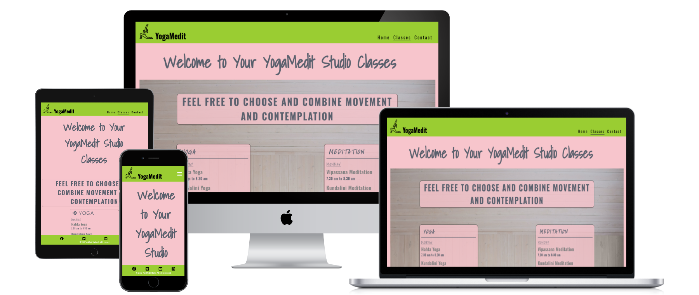

<h1 align="center">YogaMedit yoga end meditation Website</h1>

[View the live project here](https://davidelan.github.io/ci-p1-spiritual/)

YogaMedit is a website that gives visibility and describes the ( imaginary :-) ) yoga and meditation studio situated in Berlin. The studio offers yoga nad meditation courses. THe site is targeted toward people who are interested in movement, physical flexibility, fitness, well being, stress relief, contemplation and self growth. The website is useful to people who want to check out the vision of the studio centre, the location and the classes schedule.

## Index – Table of Contents
* [User Experience (UX)](#user-experience-ux) 
* [Features](#features)
* [Design](#design)
* [Technologies Used](#technologies-used)
* [Testing](#testing)
* [Deployment](#deployment)
* [Credits](#credits)

## User Experience (UX)

-   ### User stories

    -   #### A. First Time Visitor Goals

        1. As a First Time Visitor, I want to easily understand the main purpose of the site and learn more about the yoga and meditation studio.
        2. As a First Time Visitor, I want to be able to easily navigate throughout different pages of the website and find relevant content.
        3. As a First Time Visitor, I want to be able to easily navigate to and view the schedule of the various yoga and meditation classes.
        4. As a First Time Visitor, I want to be able to easily find where the organisation is located.
        5. As a First Time Visitor, I want to be able to send a message or feedback to the yoga and meditation studio.

    -   #### B. Returning Visitor Goals

        1. As a Returning Visitor, I want to be able to access and view the menu quickly and easily.
        2. As a Returning Visitor, I want to be able to check schedule of the various yoga and meditation classes quickly and easily.
        3. As a Returning Visitor, I want to be able to contact the the yoga and meditation studio to give feedback or ask questions.

    -   #### C. Frequent User Goals
        1. I want to be able to easily navigate to and view the schedule of the various yoga and meditation classes.
     

## Features

### Existing Features

-   __F01 Navigation Bar__

    - The navigation bar has a consistent look and placement on all three pages of the website supporting easy navigation. It is fixed, therefore always available to the user. It includes a simple Logo, Home page, Menu and Contact links and is responsive on multiple screen sizes. On small screens (e.g. mobile devices) the Home, Menu and Contact links move to under the Logo.

      

    __F02 Landing Page image and call to action__

    - The landing area includes a yoga photograph and two colums at each side of the image. On the left the heading Yoga with a brief descprition and on the right-hand-side the headin Meditation also with a small description. The descriptions explain the benefits of the two activities inviting the user to engage.

    - A "See our Classes" button is placed under the page image so that the user can directly go and check out the schedule of Yoga and Meditation classes.

    

