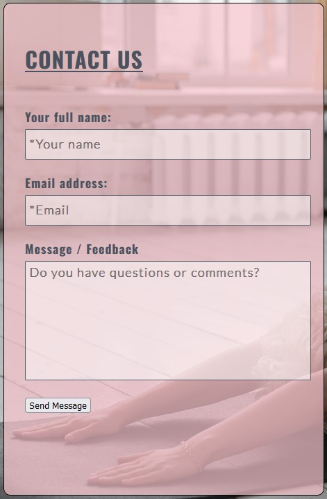

<h1 align="center">YogaMedit yoga end meditation Website</h1>

[View the live project here](https://davidelan.github.io/ci-p1-spiritual/)

YogaMedit is a website that gives visibility and describes the ( imaginary :-) ) yoga and meditation studio situated in Berlin. The studio offers yoga nad meditation courses. THe site is targeted toward people who are interested in movement, physical flexibility, fitness, well being, stress relief, contemplation and self growth. The website is useful to people who want to check out the vision of the studio centre, the location and the classes schedule.

## Index – Table of Contents
* [User Experience (UX)](#user-experience-ux) 
* [Features](#features)
* [Design](#design)
* [Technologies Used](#technologies-used)
* [Testing](#testing)
* [Deployment](#deployment)
* [Credits](#credits)

## User Experience (UX)

-   ### User stories

    -   #### A. First Time Visitor Goals

        1. As a First Time Visitor, I want to easily understand the main purpose of the site and learn more about the yoga and meditation studio.
        2. As a First Time Visitor, I want to be able to easily navigate throughout different pages of the website and find relevant content.
        3. As a First Time Visitor, I want to be able to easily navigate to and view the schedule of the various yoga and meditation classes.
        4. As a First Time Visitor, I want to be able to easily find where the organisation is located.
        5. As a First Time Visitor, I want to be able to send a message or feedback to the yoga and meditation studio.

    -   #### B. Returning Visitor Goals

        1. As a Returning Visitor, I want to be able to access and view the menu quickly and easily.
        2. As a Returning Visitor, I want to be able to check schedule of the various yoga and meditation classes quickly and easily.
        3. As a Returning Visitor, I want to be able to contact the the yoga and meditation studio to give feedback or ask questions.

    -   #### C. Frequent User Goals
        1. I want to be able to easily navigate to and view the schedule of the various yoga and meditation classes.
     

## Features

### Existing Features

- __F01 Navigation Bar__

    - The navigation bar has a consistent look and placement on all three pages of the website supporting easy navigation. It is fixed, therefore always available to the user. It includes a simple Logo, Home page, Menu and Contact links and is responsive on multiple screen sizes. On small screens (e.g. mobile devices) the Home, Menu and Contact links move to under the Logo (becomes an hamburger menu with a scroll down menu).

      

 - __F02 Landing Page image and call to action__

    - The landing area includes a yoga photograph and two colums at each side of the image. On the left the heading Yoga with a brief descprition and on the right-hand-side the headin Meditation also with a small description. The descriptions explain the benefits of the two activities inviting the user to engage.

    - A "See our Classes" button is placed under the page image so that the user can directly go and check out the schedule of Yoga and Meditation classes.

    

- __F03 Tagline__

    - The tagline "Elevate with Yoga & Meditation" appears on the home page and welcomes the user with an appealing message about the potential benefits of Yoga and Meditation.

      

- __F04 Company Ideals section__

    - The ideals of the Yoga and Meditation studio are presented in the brief Yoga and Meditation side columns. The page image in the middle of the page confers the idea and the style of the studio.

      

- __F05 Footer__

    - The footer is simple and consistent in all three (plus the message confirmation page for the inquiry form in the contact page) so that it is easy to use and to reognize. 

        - Stay in Touch - this area has links to social media sites associated with the organisation encouraging the user to keep connected.  The links will open in a new tab so that the user is not sent away from the company web page. The links currently just go to the social media main websites.

      

- __F06 Classes Page__

    - The classes page shows in a straight forward way the classes schedule for Yoga and the classes schedule for Meditation. The schedules are divided in two columns with the Yoga weekly classes on the left and the meditation ones in the left-hand side column.  
    
    - In the classes page there is a background image that shows a girl doing yoga. The image goes to the bottom of the page (not anymore as a background in small screens) 

       

- __F07 Contact Page - 'How to Find Us'__

    - In the "How to Find Us" section of the page, there is a simple googlemap map which shows the location of the Yoga studio. If the "View larger map" is clicked, a new separate tab is open with the googlemap location. 
    At the bottom of the map the full address is reported.

      

- __F08 Contact Page - 'Contact Us'__

    - In the "Contact us" part of the Contact page the visitor can easily send a message to the Yoga studio by entering the name, the email address and the text message. Once the submit button is pressed a thanks confirmation web page will open (described below in section 09). 

      

- __F09 Thanks Page__

    - After filling up the submitting form in the Contact page, the user can send a message to the studio. In this case a thanks page is displayed stating that the message has been received and thanking the visitor. Under the confirmation message there is a "Back to Home" button that allows the user to go bac to the home page. 

      

      

### Features which could be implemented in the future

- __User Interfece__
    - As this is a simple web site there are quite a few things that could be further implemented. The UI (User Inerface) could be made more artistic and elaborated. 

- __Extra Information__
    - The web site only presents the visitor with a minimal amount of information. A "Team" page could be added. Information about the vision, of the studio could be included. A blog with interesting information about the studio, yoga and meditation would also be good.

## Design

-   ### Imagery
    -   The three images slected for the 3 pages (two as background image and one as the page image) were chosen because they portray persons who engage in yoga activities and they are therefore eye-catching and inviting for the visitor. The sun and the moon associated with Yoga and Meditation in both the index and classes page gives a more pleasent and maybe spiritual look to the pages.  

-   ### Colour Scheme
    -   The main scheme of the web site is a combination of background colour pink rgb(247, 197, 204) and gray #59606d for the fonts colour. There are a few exeptions in which a darker version of the gray was used #4b525e for a better contrast. The colors were chosen by me trying to convey a sense of calmness and relaxation which are typically associated with Yoga and Meditation.

-   ### Typography
    -   In order to import the fonts Oswald, (Lato only in the submitting form) and Shadows Into Light, two Google fonts were imported in the CSS style file. In addiction to the already established simple and modern feelin of Oswald, I wanted to give an extra more artistic touch with the Shadows Into Light font.

-   ### Wireframes

    -   #### Main Page Wireframes

        

    -   #### Classes Page Wireframes

        

    -   #### Contact Page Wireframes

        

### Languages Used

-   [HTML5](https://en.wikipedia.org/wiki/HTML5)
-   [CSS3](https://en.wikipedia.org/wiki/Cascading_Style_Sheets)

### Frameworks, Libraries & Programs Used

-   [Google Fonts:](https://fonts.google.com/) was used to import the 'Lato', 'Oswald' and  'Shadows Into Light' fonts into the style.css file which are used on all pages of the project.
-   [Font Awesome:](https://fontawesome.com/) was used to add icons for aesthetic and UX purposes.
-   [Git:](https://git-scm.com/) was used for version control by utilising the Gitpod terminal to commit to Git and Push to GitHub.
-   [GitHub:](https://github.com/) is used as the respository for the projects code after being pushed from Git.
-   [Gimp:](https://gimp.org/) was used to create the wireframes during the design process.

    
## Testing

### Validator Testing

- [HTML Validator](https://validator.w3.org/)

    - result for index.html
      
    - result for classes.html
      
    - result for contact.html
      